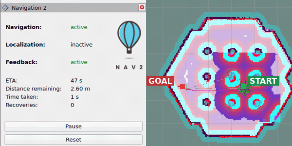

# Nav2: migrate one client, keep the system

This tutorial replaces one goal client at the edge of a working Nav2 system.
Every Nav2 server remains conventional and unchanged.

```text
Before: conventional goal client ── NavigateToPose ──> unchanged Nav2
After:  NoDL-backed goal client  ── NavigateToPose ──> unchanged Nav2
```

This demonstrates incremental NoDL adoption: NoDL-backed and conventional nodes can coexist across an ordinary ROS
interface.

Choose C++ or Python in any language tab.
The browser remembers that choice for the other grouped tabs on this page.

## 1. Start with working Nav2

In a workspace with Nav2 and the TurtleBot 3 simulation installed, launch the upstream system:

```bash
export TURTLEBOT3_MODEL=waffle
ros2 launch nav2_bringup tb3_simulation_launch.py headless:=False
```

Use **2D Pose Estimate** in RViz to initialize the robot.
Select **Nav2 Goal**, choose a reachable point, and confirm that the robot moves there.

This is the behavior to preserve.
Leave Nav2 running for the rest of the tutorial.



## 2. Migrate one client

The migration boundary is a small node that sends one `NavigateToPose` goal.
These are the files involved:

::::{tabs}
:::{group-tab} C++

```text
navigate_to_pose_nodl/
├── nodl/
│   ├── navigate_to_pose_client.nodl.yaml
│   └── navigate_to_pose_client_codegen.nodl.yaml
├── CMakeLists.txt
├── package.xml
└── src/
    ├── navigate_to_pose_client.cpp
    ├── navigate_to_pose_client_nodl.cpp
    ├── navigation.cpp
    └── navigation.hpp
```

:::

:::{group-tab} Python

```text
navigate_to_pose_nodl/
├── nodl/navigate_to_pose_client.nodl.yaml
├── CMakeLists.txt
├── package.xml
└── navigate_to_pose_nodl/
    ├── __init__.py
    ├── navigate_to_pose_client.py
    ├── navigate_to_pose_client_nodl.py
    └── navigation.py
```

:::
::::

The Python example uses `ament_cmake_python` so NoDL generation runs in `CMakeLists.txt`; a pure `ament_python` package
would instead use `setup.py`, `setup.cfg`, and `resource/`.

### `nodl/navigate_to_pose_client.nodl.yaml`

Declare the action boundary once for both languages:

```{literalinclude} ../../../examples/nodl_tutorials/navigate_to_pose_nodl/nodl/navigate_to_pose_client.nodl.yaml
:language: yaml
```

The contract says nothing about Nav2's planner, controller, lifecycle nodes, costmaps, or behavior tree.
Those conventional components remain behind the `NavigateToPose` interface.
For C++ generation, `navigate_to_pose_client_codegen.nodl.yaml` composes this public contract with
`nodl://rclcpp/node`.
Conformance continues to use the public contract shown above.

### `CMakeLists.txt`

Register the contract, generate the selected language's base, and build the `_nodl` executable.
The highlighted lines are the NoDL-specific additions to the package's actual `CMakeLists.txt`:

::::{tabs}
:::{group-tab} C++

```{literalinclude} ../../../examples/nodl_tutorials/navigate_to_pose_nodl/CMakeLists.txt
:language: cmake
:lines: 6,8-21
:emphasize-lines: 4,7,13
```

:::

:::{group-tab} Python

```{literalinclude} ../../../examples/nodl_tutorials/navigate_to_pose_nodl/CMakeLists.txt
:language: cmake
:lines: 6-10,23-30
:emphasize-lines: 5,7
```

:::
::::

### Client implementation

Before migration, each client creates `ActionClient` directly.
After migration, it inherits the generated base instead.

::::{tabs}
:::{group-tab} C++

**Before: `src/navigate_to_pose_client.cpp`**

```{literalinclude} ../../../examples/nodl_tutorials/navigate_to_pose_nodl/src/navigate_to_pose_client.cpp
:language: cpp
:start-at: class NavigateToPoseClient
:end-before: int main
```

**After: `src/navigate_to_pose_client_nodl.cpp`**

```{literalinclude} ../../../examples/nodl_tutorials/navigate_to_pose_nodl/src/navigate_to_pose_client_nodl.cpp
:language: cpp
:start-at: class NavigateToPoseClientNodl
:end-before: int main
```

:::{note}
:collapsible: closed
:title: Generated C++ base

```{literalinclude} ../../../examples/nodl_tutorials/navigate_to_pose_nodl/test/expected/generated_cpp.txt
:language: cpp
```

:::

:::

:::{group-tab} Python

**Before: `navigate_to_pose_nodl/navigate_to_pose_client.py`**

```{literalinclude} ../../../examples/nodl_tutorials/navigate_to_pose_nodl/navigate_to_pose_nodl/navigate_to_pose_client.py
:language: python
:start-at: class NavigateToPoseClient
:end-before: def main
```

**After: `navigate_to_pose_nodl/navigate_to_pose_client_nodl.py`**

```{literalinclude} ../../../examples/nodl_tutorials/navigate_to_pose_nodl/navigate_to_pose_nodl/navigate_to_pose_client_nodl.py
:language: python
:start-at: class NavigateToPoseClientNodl
:end-before: def main
```

:::{note}
:collapsible: closed
:title: Generated Python base

```{literalinclude} ../../../examples/nodl_tutorials/navigate_to_pose_nodl/test/expected/generated_python.txt
:language: python
```

:::

:::
::::

The generated base maps the contract's `NavigateToPose` type and `navigate_to_pose` name to the action-client member
used by the thin subclass.
Only that interface wiring changes.
The application still owns the goal, waiting policy, result handling, and exit status.

## 3. Build, run, and verify the mixed system

### Build

Build and source the migrated clients:

```bash
colcon build --packages-up-to navigate_to_pose_nodl
source install/setup.bash
```

### Verify interactively

Leave the conventional Nav2 launch running.
Run either NoDL-backed client toward a goal that takes several seconds, then check its interface from another terminal:

::::{tabs}
:::{group-tab} C++

```bash
# Terminal 1
ros2 run navigate_to_pose_nodl navigate_to_pose_client_nodl_cpp -2.0 -0.5

# Terminal 2, while the robot is moving
ros2 nodl conform /navigate_to_pose_client \
  --file examples/nodl_tutorials/navigate_to_pose_nodl/nodl/navigate_to_pose_client.nodl.yaml
```

```text
/navigate_to_pose_client: conforms
```

:::

:::{group-tab} Python

```bash
# Terminal 1
ros2 run navigate_to_pose_nodl navigate_to_pose_client_nodl -2.0 -0.5

# Terminal 2, while the robot is moving
ros2 nodl conform /navigate_to_pose_client_py \
  --file examples/nodl_tutorials/navigate_to_pose_nodl/nodl/navigate_to_pose_client.nodl.yaml
```

```text
/navigate_to_pose_client_py: conforms
```

:::
::::

The robot should reach the selected goal.
Its navigation proves that the mixed system still works; conformance proves that the migrated client exposes its
declared ROS interface.

### Verify automatically

The same interface checks run without the simulator in CI:

```bash
colcon test --packages-select navigate_to_pose_nodl
colcon test-result --verbose
```

The conformance tests start each NoDL-backed client without coordinates, which keeps its interface available without
sending a goal.
The remaining fixture checks cover contract registration, the documented generated code, and both Python clients.

:::{seealso}
**Next: compose a Nav2 server contract.**

This tutorial uses `include` only to supply the C++ client's `rclcpp::Node` base.
Tutorial 4 will use a Nav2 server to combine framework-owned lifecycle interfaces with server-owned navigation
interfaces.
Server migration needs upstream build and inheritance integration, so it belongs in a separate tutorial.
:::
